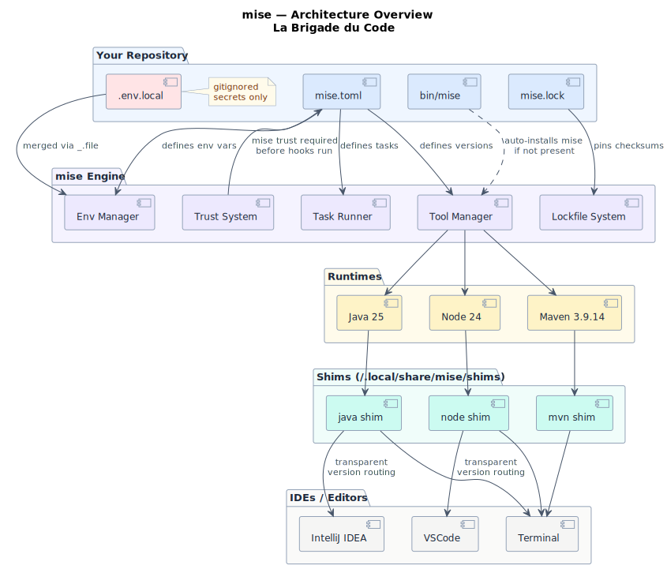
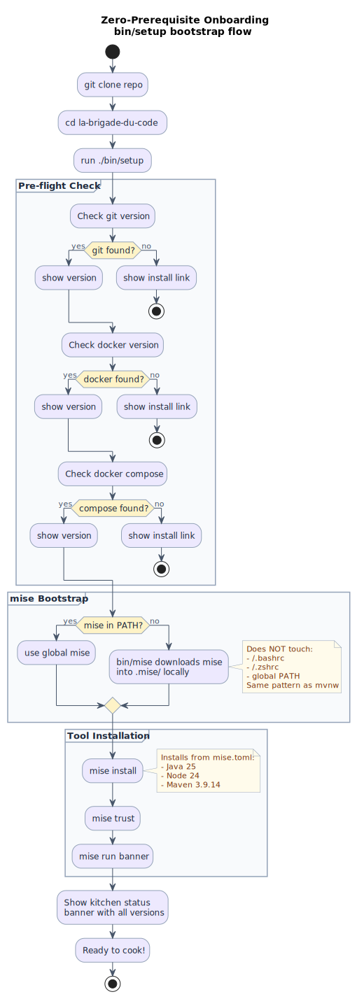
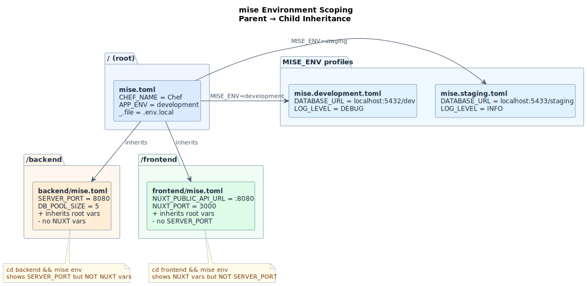
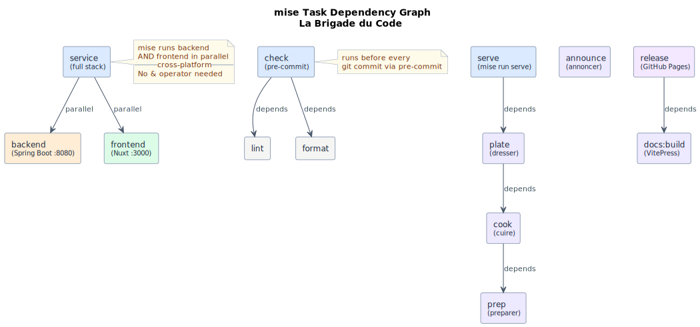
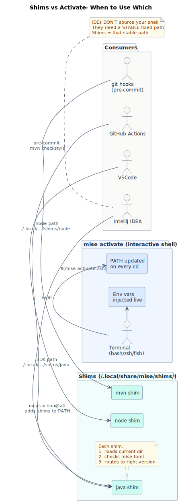

# La Brigade du Code 🍳

> *"Mise en place — everything in its place. Before service, before code."*

[](https://github.com/maoudia/la-brigade-du-code/actions/workflows/ci.yml)
[](https://github.com/maoudia/la-brigade-du-code/actions/workflows/deploy.yml)
[](https://mise.jdx.dev)
[](https://openjdk.org/projects/jdk/25/)
[](https://nodejs.org)
[](https://spring.io/projects/spring-boot)
[](https://nuxt.com)
[](https://maoudia.github.io/la-brigade-du-code/)
[](https://maoudia.github.io/la-brigade-du-code/slides/)
[](LICENSE)

A hands-on codelab that teaches **mise-en-place** — the developer tool that replaces nvm, sdkman, direnv, Makefile, and npm scripts with a single `mise.toml`.

Built around a French kitchen brigade theme. 7 labs, zero excuses.

---

## Quick Start

> 📽️ **Slides:** [maoudia.github.io/la-brigade-du-code/slides](https://maoudia.github.io/la-brigade-du-code/slides/)


> No mise required. Prerequisites: git, `docker` CLI, `docker compose` CLI.
> Engine can be **Docker** (native) or **Podman** with docker alias (`podman-docker` / `podman compose`).
> On Windows: Podman Desktop provides `docker` and `docker compose` aliases natively.

```bash
# macOS / Linux / WSL
git clone https://github.com/maoudia/la-brigade-du-code
cd la-brigade-du-code
./bin/setup
```

```powershell
# Windows PowerShell
git clone https://github.com/maoudia/la-brigade-du-code
cd la-brigade-du-code
.\bin\setup.ps1
```

That's it. `bin/setup` handles everything:
- Checks git, docker, docker compose
- Installs mise locally (no global changes)
- Installs Java 25, Node 24, Maven 3.9.14
- Shows the kitchen banner

---

## What you'll learn

| # | Lab | Theme |
|---|---|---|
| 00 | 🔧 Onboarding | Bootstrap, shims, IDE setup |
| 01 | 🍳 La Mise en Place | Tool versioning + lockfile |
| 02 | 🧅 Les Ingredients | Env scoping + MISE_ENV profiles |
| 03 | 🥘 Les Recettes | Tasks + cross-platform |
| 04 | 🔥 Le Coup de Feu | Hooks + watchers |
| 05 | 🍽️ Le Service | Monorepo full stack |
| 06 | 👨‍🍳 Le Chef | Security + CI/CD + docs |
| 07 | 🤖 Le Sous-Chef Digital | mise MCP + OpenCode + Copilot |

---

## Stack

| Tool | Version | Role |
|---|---|---|
| [mise](https://mise.jdx.dev) | `2026.4.8` | Everything |
| Java | `25` LTS | Backend runtime |
| Node.js | `24` LTS | Frontend runtime |
| Maven | `3.9.14` | Backend build |
| Spring Boot | `4.0.5` | Backend framework |
| Nuxt | `4.2.2` | Frontend framework |
| VitePress | `1.6.4` | Docs site |
| Docker / Podman | `29.4.0` / `5.8.1` | Containers (via `docker` CLI) |
| Docker Compose | `5.1.2` | Orchestration (via `docker compose` CLI) |

---


## Slides

Built with [reveal.js 5.1](https://revealjs.com) — open format, version-controlled, CDN-based.

```bash
mise run slides:dev    # live dev server
mise run slides:build  # build static HTML to slides/_dist/
mise run slides:pdf    # export to PDF
```

Source: [`slides/index.html`](slides/index.html) — plain HTML + CDN reveal.js, no proprietary format.

## Available tasks

```bash
mise tasks ls          # list all tasks
mise run banner        # show kitchen status
mise run service       # start backend + frontend in parallel
mise run docker        # start full stack with Docker Compose
mise run check         # lint + format (pre-commit)
mise run docs:dev      # start VitePress docs
mise run versions      # show all pinned versions
```

---

## Environment profiles

```bash
# Development (default)
MISE_ENV=development mise run service

# Staging
MISE_ENV=staging mise run service

# Production
MISE_ENV=production mise env
```

---

## IDE Setup

### IntelliJ IDEA
Install the [intellij-mise plugin](https://github.com/134130/intellij-mise) — auto-configures JDK, tasks, env vars.

Or point the SDK manually to: `~/.local/share/mise/shims/java`

### VSCode
Install the [mise-vscode extension](https://marketplace.visualstudio.com/items?itemName=hverlin.mise-vscode) — auto-configures all extensions.

Or add to your shell profile:
```bash
eval "$(mise activate zsh --shims)"
```

Full guide: [`lab-00-onboarding/ide/`](lab-00-onboarding/ide/)

---

## CI/CD

| Workflow | Trigger | Matrix |
|---|---|---|
| `ci.yml` | push + PR | ubuntu / macos / windows |
| `deploy.yml` | push main + manual | ubuntu |
| `update.yml` | every Monday 08:00 | ubuntu |

---

## Diagrams

PlantUML sources in [`diagrams/`](diagrams/) — rendered to SVG via `mise run diagrams:render`.
Full interactive view: [maoudia.github.io/la-brigade-du-code/diagrams/](https://maoudia.github.io/la-brigade-du-code/diagrams/)

| Diagram | |
|---|---|
| **Architecture** — mise engine, tools, shims, IDEs |  |
| **Bootstrap flow** — zero-prerequisite onboarding |  |
| **Env scoping** — root → backend/frontend inheritance |  |
| **Task dependencies** — depends graph |  |
| **Shims vs activate** — IDE integration model |  |

---

## Going Further

Not everything is covered in the 8 labs. See the full feature appendix:
👉 [APPENDIX-FEATURES.md](APPENDIX-FEATURES.md) — every mise feature not in the codelab, with docs links.

---

## License

MIT — fork it, use it, teach it.

---

> *"La cuisine a cuisiné elle-même."*
> *The kitchen cooked itself. 🤌*
